# NEXUS Remote

Use your phone as the keyboard and trackpad for a
[NEXUS](https://github.com/vaibhav8600-rgb/nexus) dongle. The phone talks to
NEXUS over Bluetooth; NEXUS is a normal USB keyboard and mouse to the
computer, so nothing is installed on the computer.

A web app (PWA) in React, Vite and TypeScript, styled after Apple's Human
Interface Guidelines, with Automatic, Light and Dark themes.

One screen, like a laptop's trackpad: the whole background is the pad, a
strip down the right edge scrolls, three buttons along the bottom click. The
toolbar opens the rest in place - settings (≡), a media click wheel (▷),
shortcuts and special keys (▭), NEXUS's own controls (🎮), and the phone's
own keyboard (⌨) with a strip of Ctrl/Alt/Win/Esc/arrows above it - so
autocorrect, swipe typing and dictation all work.

The NEXUS controls are the keyboard's game layer: a D-pad with OK, Rotate and
Drop for the games on the dongle, Back, Home, Games, Menu and Host for its
screens, the theme, Save, and whether keys go out over USB or BLE. Buttons
press and release like keys, so holding an arrow repeats. They need NEXUS
firmware with dongle controls; older firmware gets a note instead.

The colours are the NEXUS dongle's own: a deep indigo night lit by magenta
and cyan with a mint accent, and a lavender daylight version of the same.

| Trackpad | Keyboard | Keys | Media | NEXUS | Settings |
| --- | --- | --- | --- | --- | --- |
| 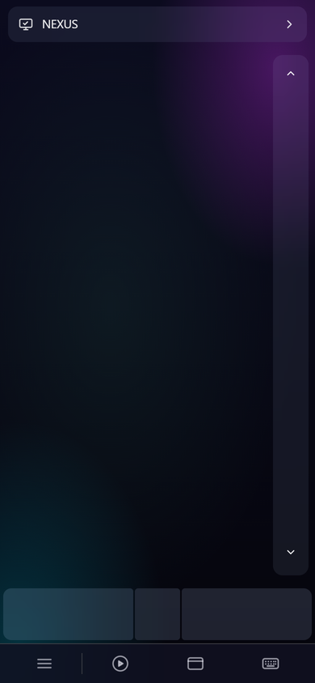 | 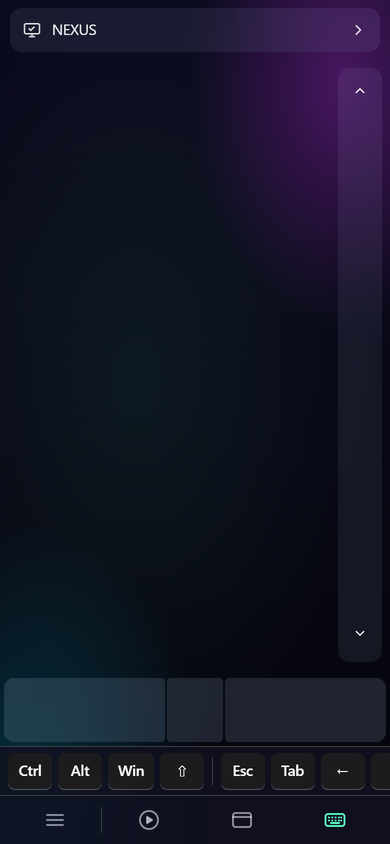 | 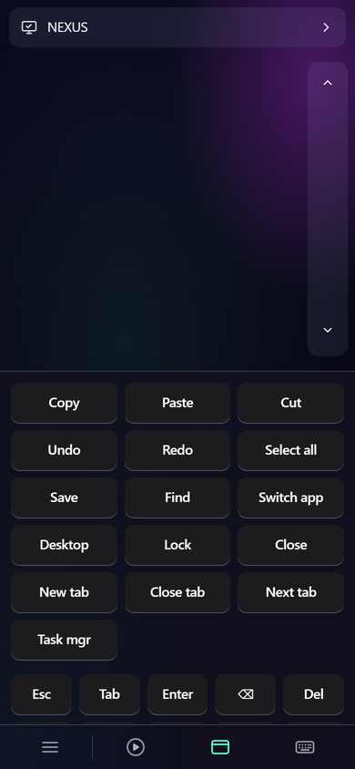 | 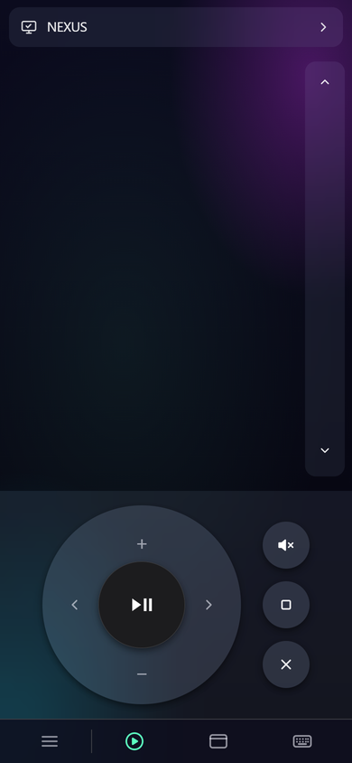 | 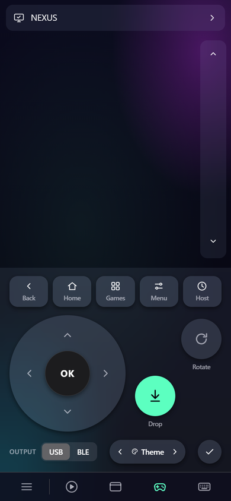 | 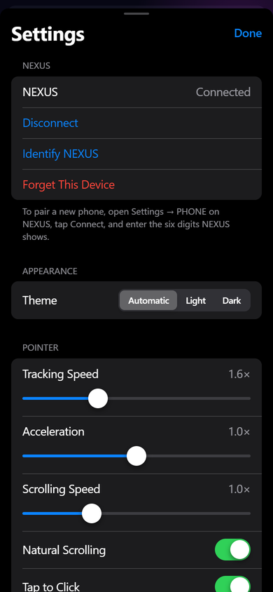 |
| 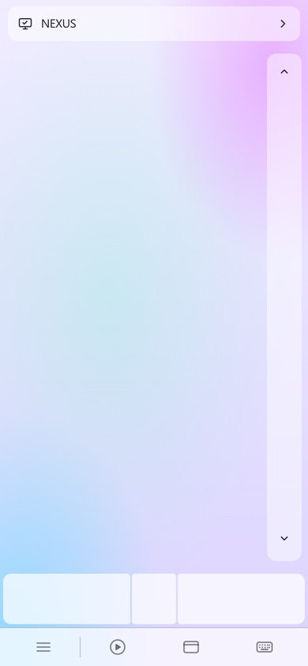 | 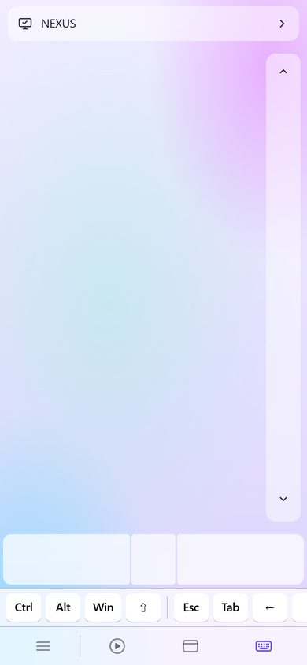 | 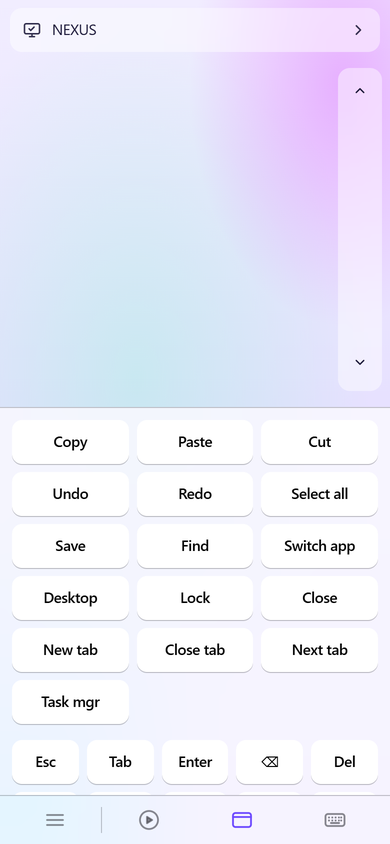 | 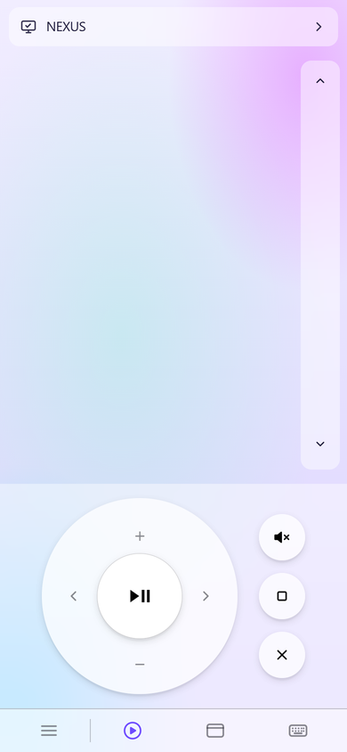 | 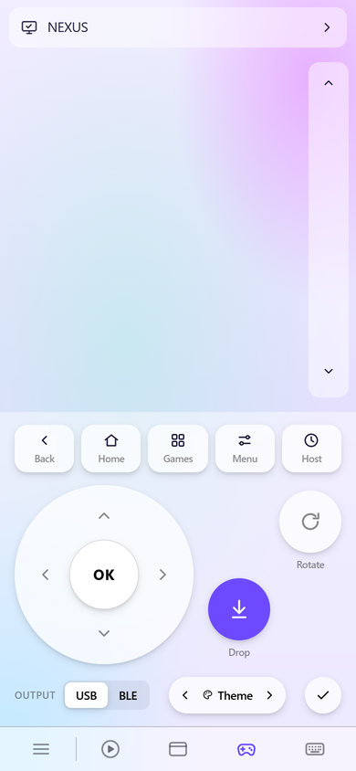 | 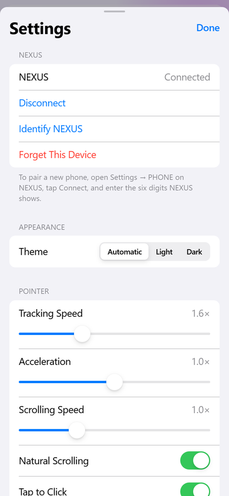 |

The keyboard view is shown without the phone's own keyboard, which opens
under the strip on a real phone.

| Phone | How |
| --- | --- |
| Android | Open the site in **Chrome**, tap **Connect**. Experimental: needs NEXUS firmware that pairs by comparing codes, and is not yet confirmed on hardware. |
| iPhone | Safari has no Web Bluetooth - open the site in **Bluefy** (free, App Store). |

NEXUS needs `CONFIG_NEXUS_REMOTE_INPUT=y`; pairing and setup are in the
NEXUS repo's `docs/remote-input.md`.

## Develop

```sh
npm install
npm run dev     # http://localhost:5173
npm test        # protocol, text and gesture tests
npm run build   # typecheck, tests, then the production build in dist/
```

Web Bluetooth only runs on `localhost` or HTTPS, so on a phone test against
a deployed preview rather than your LAN address.

## Deploy on Vercel

Import the repository in Vercel. It detects Vite, runs `npm run build` -
which runs the tests first, so a failing test never ships - and serves
`dist/`. `vercel.json` stops the service worker from being cached and allows
Bluetooth for the page.

## Protocol

`src/protocol/` implements the NEXUS Remote Input protocol v1, specified in
the NEXUS repo's `docs/remote-input-protocol.md`. The tests check every
encoder against the example bytes on that page; if the two disagree, a test
fails. `src/ble/link.ts` handles the Web Bluetooth side: one GATT operation
at a time, mouse packets first, keys and text in one strict FIFO, and text
paced by the free space NEXUS reports.
